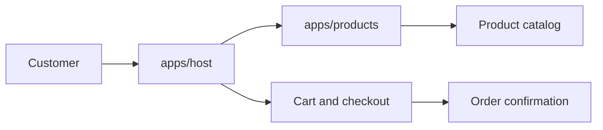

# Module Federation E-commerce

A small e-commerce application built with React, TypeScript, Vite, and Module Federation.

The project demonstrates how to structure a micro-frontend application while keeping shared UI, state, validation, and business responsibilities separated.

## Features

- React 19
- TypeScript
- Vite
- Module Federation
- Host application
- Products remote application
- Shared UI package
- Shared cart types and validation
- Design tokens
- Semantic design tokens
- Cart state management
- Cart persistence
- Cart repository/service
- Quantity controls
- Accessible cart drawer
- Keyboard focus trap
- Cart validation
- Checkout flow
- Order summary
- Async order service
- Order confirmation
- Cart cleared only after successful order creation

---

## Project Structure

```text
module-federation-ecommerce/
├── apps/
│   ├── host/
│   │   ├── src/
│   │   │   ├── components/
│   │   │   │   ├── cart/
│   │   │   │   ├── checkout/
│   │   │   │   ├── header/
│   │   │   │   └── order-confirmation/
│   │   │   ├── services/
│   │   │   ├── types/
│   │   │   └── App.tsx
│   │   └── package.json
│   │
│   └── products/
│       ├── src/
│       │   ├── components/
│       │   │   └── card/
│       │   │   └── catalog/
│       │   ├── data/
│       │   └── App.tsx
│       └── package.json
│
├── packages/
│   ├── shared/
│   │   ├── src/
│   │   │   └── events/
│   │   │       ├── cart.ts
│   │   │       └── cartValidation.ts
│   │   └── package.json
│   │
│   └── ui/
│       ├── src/
│       │   ├── components/
│       │   └── tokens/
│       │       ├── color.css
│       │       └── ...
│       └── package.json
│
├── package.json
├── package-lock.json
└── README.md
```

## Architecture

The application is split into three main areas.

```text
                    ┌─────────────────┐
                    │      Host       │
                    │                 │
                    │ App / Cart /    │
                    │ Checkout /      │
                    │ Orders          │
                    └────────┬────────┘
                             │
                             │ Module Federation
                             ▼
                    ┌─────────────────┐
                    │    Products     │
                    │     Remote      │
                    └─────────────────┘


             Shared packages
                    │
          ┌─────────┴─────────┐
          ▼                   ▼
   @ecommerce/ui       @ecommerce/shared
          │                   │
     UI components       Types / validation
     Design tokens       Cart contracts
```

## Design Tokens

The UI package uses design tokens instead of hard-coded colors throughout the applications.

```text
:root {
  --color-primary: #2563eb;
  --color-primary-hover: #1d4ed8;

  --color-text: #111827;
  --color-text-muted: #6b7280;

  --color-background: #ffffff;
  --color-background-muted: #f3f4f6;

  --color-border: #e5e7eb;

  --color-success: #16a34a;
  --color-danger: #dc2626;
}
```

## Requirements

- Node.js 22.20.0 or newer
- npm

## Installation

Install dependencies from the repository root:

```bash
npm install
```

## Running the apps

Use two terminals from the repository root.

### Terminal 1 — products remote

```bash
npm run preview:products
```

The remote app preview runs on:

- `products`: http://localhost:4173

### Terminal 2 — host app

```bash
npm run dev:host
```

The host app runs on:

- `host`: http://localhost:5173

## Environment configuration

The host app loads the products remote URL from environment files.

- Local development: `.env.development`
- Production: `.env.production`

Example local value:

```env
VITE_PRODUCTS_LOCAL_URL=http://localhost:4173/assets/remoteEntry.js
```

Example production value:

```env
VITE_PRODUCTS_REMOTE_URL=https://my-domaine.com/products/assets/remoteEntry.js
```

## Build

Build both workspaces from the repository root:

```bash
npm run build
```

For production mode with the production environment values:

```bash
npm run build:prod
```

## Lint

Lint all workspaces that define a lint script:

```bash
npm run lint
```

The root script uses `--if-present` so packages without a custom lint command are skipped automatically.

## Workspaces

The root package.json manages the applications and packages through npm workspaces.

Conceptually:

```json
{
  "workspaces": ["apps/*", "packages/*"]
}
```

This allows local packages such as:

```
@ecommerce/ui
@ecommerce/shared
```

## Module Federation

The project uses Module Federation to expose the Products application to the Host.

Conceptually:

```text
Host
 │
 └── products/Products
          │
          ▼
      Products Remote

```

The Host loads the remote lazily:

```TypeScript
const Products = lazy(
  () => import("products/Products"),
);
```

This allows the Products application to remain an independently developed application.

## How It Works

The host loads the remote catalog from the products app via module federation. The catalog drives browsing, while the host owns the cart, checkout, and order confirmation flow.



Key flows:

- Browse products in the remote catalog.
- Add items to the cart from the host shell.
- Review cart contents and start checkout.
- Confirm checkout to create an order and clear the cart.

## Notes

- The host expects the products remote to be available at `http://localhost:4173/assets/remoteEntry.js` in local development.
- In production, update `VITE_PRODUCTS_REMOTE_URL` in `.env.production` to match the deployed remote entry URL.
- If you change the remote port or filename, update the host Vite federation config and the environment values accordingly.

## Future Improvements

Possible next steps:

- Real checkout API
- Server-side cart validation
- Product availability/stock validation
- Price validation against the backend
- Taxes
- Shipping
- Discount/coupon support
- Payment integration
- Order history
- Authentication
- Error boundaries
- Automated tests
- E2E tests
- Loading/error states
- Production Module Federation deployment
- Shared version management
- CI/CD
